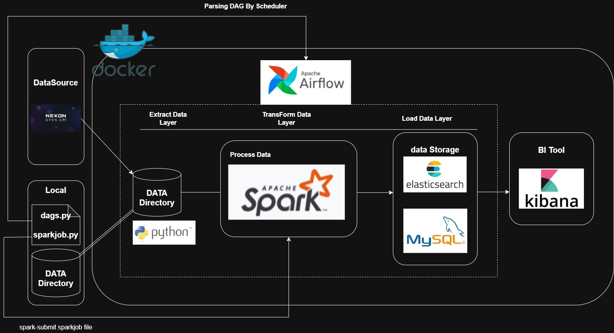
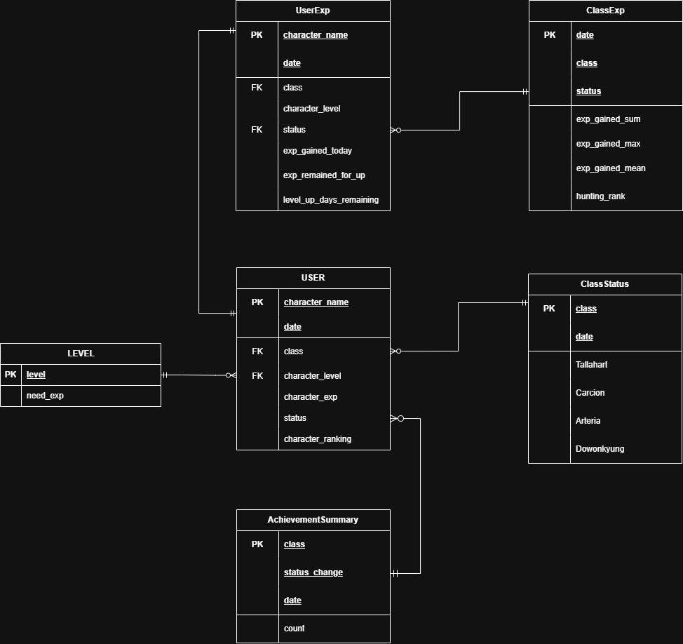
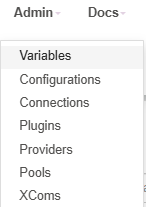
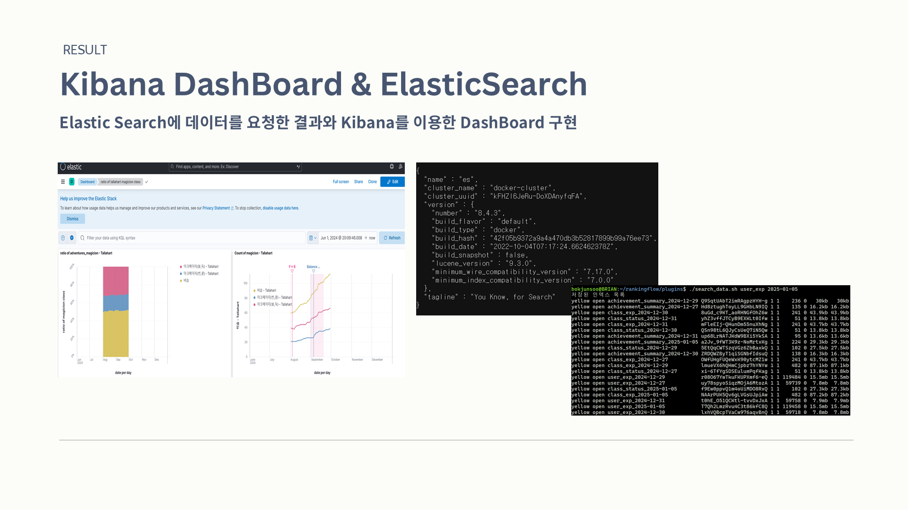

# 👋 rankingflow
`Airflow`를 이용해 자동화된 `데이터 파이프라인`을 구축하는 프로젝트입니다.

ETL과정은 다음과 같습니다 !
- `Nexon Open API`의 개인 랭킹 데이터 소스를 수집하여 로컬디렉터리에 저장합니다.
- `Python`으로 작성된 `SparkJob`을 통해 데이터를 처리 및 정제 하고 이 과정을 통해 데이터 테이블을 생성합니다.
- 생성된 데이터 테이블을 `MySQL`과 `ElasticSearch`에 저장합니다.
- `Kibana`를 이용해 저장된 데이터를 시각화 합니다.
- 처리가 완료된 로컬디렉터리의 데이터를 삭제합니다.

`rankingflow`의 개발과정은 아래의 `velog`에 기록되어 있습니다.⬇️
> https://velog.io/@junsoobok/series/Airflow-with-Spark

# 1. ETL 아키텍쳐


# 2. DataMart


# 3. 프로젝트 시작하기
## 📥 프로젝트 클론하기
```bash
git clone https://github.com/BOKJUNSOO/rankingflow.git
```

---

## 🐋 도커엔진 다운로드하기

#### 설치전 실행

```bash
for pkg in docker.io docker-doc docker-compose docker-compose-v2 podman-docker containerd runc; do sudo apt-get remove $pkg; done
```

```bash
# Add Docker's official GPG key:
sudo apt-get update
sudo apt-get install ca-certificates curl
sudo install -m 0755 -d /etc/apt/keyrings
sudo curl -fsSL https://download.docker.com/linux/ubuntu/gpg -o /etc/apt/keyrings/docker.asc
sudo chmod a+r /etc/apt/keyrings/docker.asc
# Add the repository to Apt sources:
echo \
  "deb [arch=$(dpkg --print-architecture) signed-by=/etc/apt/keyrings/docker.asc] https://download.docker.com/linux/ubuntu \
  $(. /etc/os-release && echo "$VERSION_CODENAME") stable" | \
  sudo tee /etc/apt/sources.list.d/docker.list > /dev/null
sudo apt-get update
```

#### 도커 패키지 다운로드
```bash
sudo apt-get install docker-ce docker-ce-cli containerd.io docker-buildx-plugin docker-compose-plugin
```

#### 도커엔진 실행
```bash
sudo service docker start
```

---

## 📦 container 빌드

```bash
sudo docker compose up --build -d
[+] Running 14/14
 ✔ Network elastic0                           Created
 ✔ Container rankingflow-redis-1              Healthy
 ✔ Container rankingflow-spark-master-1       Started
 ✔ Container rankingflow-postgres-1           Healthy
 ✔ Container rankingflow-spark-worker-1       Started
 ✔ Container rankingflow-jupyterlab-1         Started
 ✔ Container rankingflow-airflow-init-1       Exited 
 ✔ Container rankingflow-airflow-triggerer-1  Started
 ✔ Container rankingflow-airflow-scheduler-1  Started
 ✔ Container rankingflow-airflow-worker-1     Started
 ✔ Container rankingflow-airflow-webserver-1  Started
 ✔ Container rankingflow-es-1                 Started
 ✔ Container rankingflow-mysql-1              Started
 ✔ Container rankingflow-kibana-1             Started
```

---

## 🗝️ Nexon Api Key 발급받고 입력하기
### 사이트에 접속해서 API키를 발급받아주세요.
> 메이플스토리 > 랭킹정보조회 > 종합 랭킹 정보 조회
> https://openapi.nexon.com/ko/

### localhost:8081로 접속합니다.

- 상단의 Admin > Variables로 들어갑니다.


- `+` 버튼을 눌러 키를 추가해줍니다
   - `Key` 부분에 `apikey_openapi_nexon`을 입력하고
   - `Val` 부분에 발급받은 키를 입력합니다.

---

## ▶️ Project Start
- `datapipline` `dags`를 `unpause` 시켜주세요.

- `elasticsearch`에 저장된 데이터를 확인합니다.
```bash
~/rankingflow/plugins$ ./search_data.sh ${date}
```
- `localhost:5601`로 접속합니다.


- `Discover`탭에서 `Create a data view`를 생성합니다.

- `Dashboard`탭에서 데이터 시각화가 가능합니다.

# 4. 디렉토리 구조
```
.
├── LICENSE
├── README.md
├── config                # airflow config 파일
│   └── airflow.cfg     
├── dags                  # airflow dags 파일
├── data                  # local 저장 위치
├── docker-compose.yaml   
├── dockerfile
├── jobs                  
│   ├── spark_common      # pyspark 파일 디렉토리
│   └── sparktest.py      # spark job 파일
├── notebooks
├── plugins               # airflow가 인식할 파일 디렉토리
│   ├── common            # python Operator용 파일
│   ├── check_data.sh     # bash Operator용 파일
|   ├── delete_data.sh
|   ├── search_data.sh
|   └── spark_submit.sh
└── resources              # Spark connection을 위한 jar파일
```
# 5. docker-compose 참고자료
- Airflow : https://airflow.apache.org/docs/apache-airflow/stable/howto/docker-compose/index.html  

- Spark : https://hub.docker.com/r/bitnami/spark  

- ElasticSearch & Kibana : https://www.elastic.co/kr/blog/getting-started-with-the-elastic-stack-and-docker-compose  

- MySQL : https://www.youtube.com/watch?v=PHahcWd1AqM
